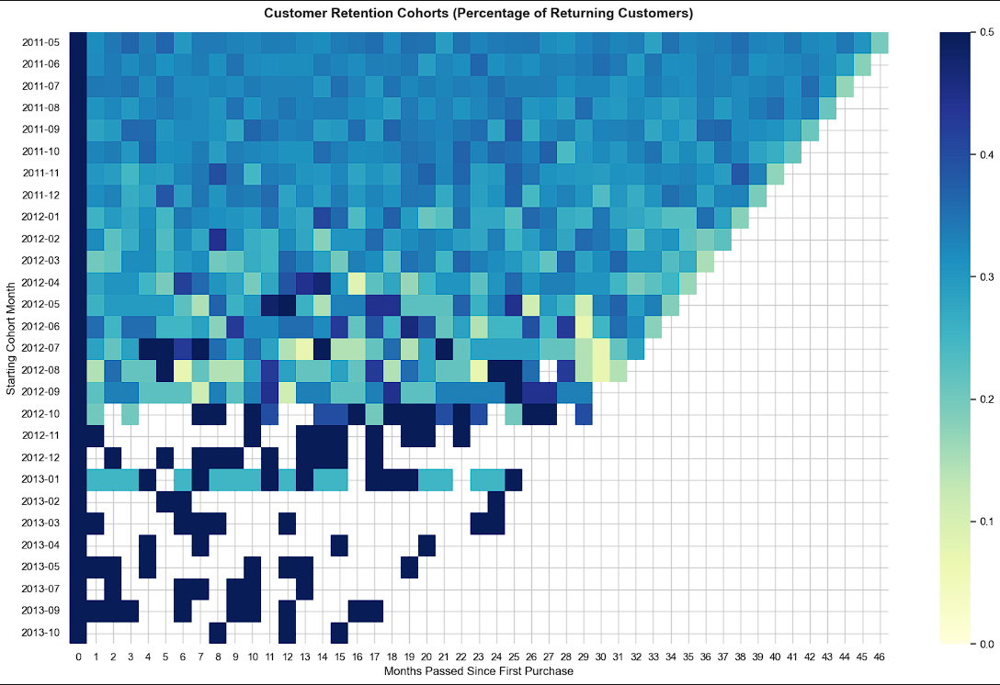
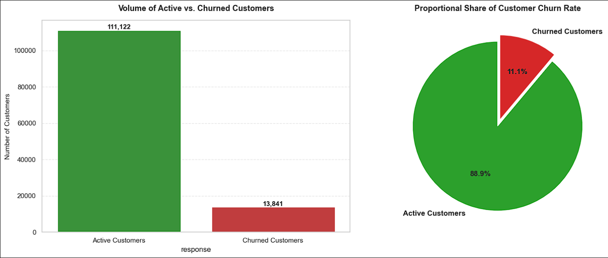
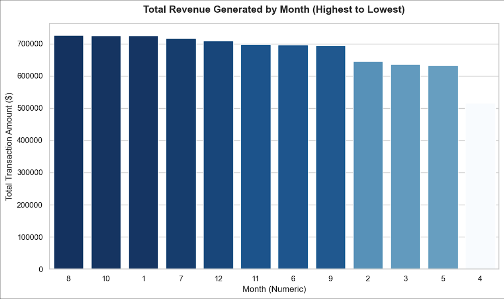
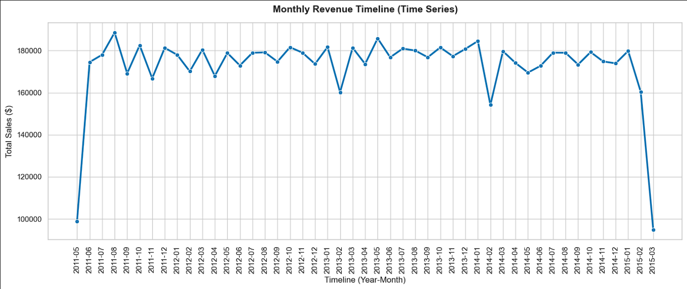
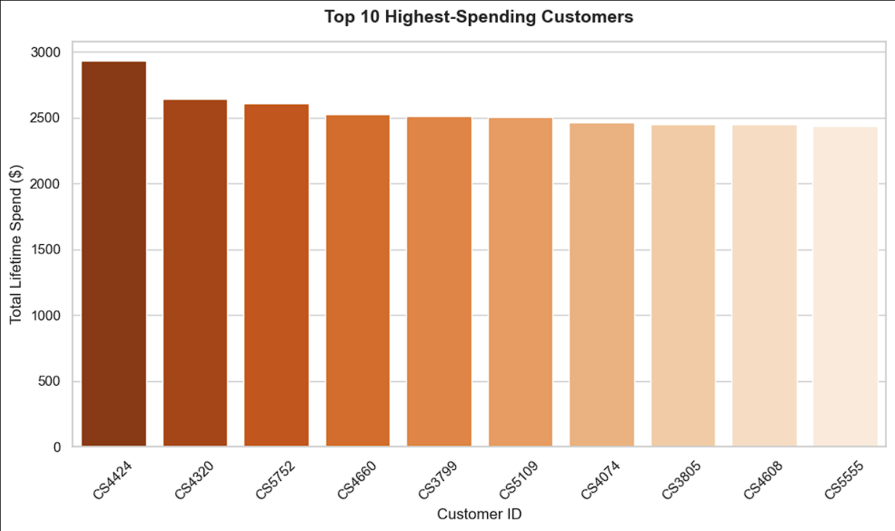
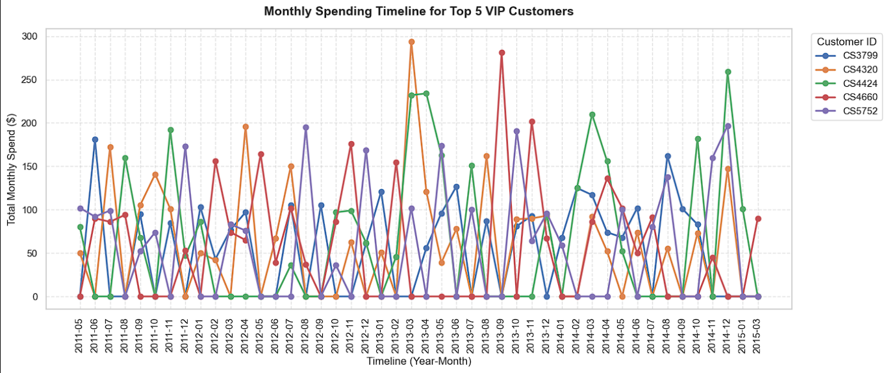

# 📊 Retail Customer Behavior & Retention Analysis

An end-to-end customer analytics project using retail transaction and customer response data to analyze purchasing behavior, revenue patterns, customer value, retention, and churn.

The project combines **Python, Pandas, SQL/MySQL, exploratory data analysis, cohort analysis, and data visualization** to transform raw retail transaction records into customer-level insights.

---

## 📈 Customer & Revenue Analysis

The Python workflow explores transaction history and customer responses to identify patterns in revenue generation, purchasing frequency, customer value, retention, and churn.

### Key Areas of Analysis

- Customer purchasing behavior
- Revenue trends
- Customer value and spending patterns
- Top customers by revenue contribution
- Monthly revenue performance
- Customer retention through cohort analysis
- VIP customer spending behavior
- Customer churn distribution

---

## 🎯 Executive Summary & Insights

The analysis provides a customer-centric view of the retail business by examining both transaction activity and customer response behavior.

- **Customer Behavior:** Transaction history is used to understand customer purchase frequency, spending, and recency.
- **Revenue Analysis:** Transaction amounts are aggregated to identify revenue patterns across calendar months and over the available transaction period.
- **Customer Value:** Customer-level features are calculated using recency, frequency, monetary value, and response activity.
- **Retention Analysis:** Cohort analysis is used to examine customer retention patterns based on the month of a customer's first purchase.
- **VIP Customers:** High-value customers are identified based on their total transaction spending.
- **Churn Analysis:** Customer response data is used to classify and analyze active and churned customer groups.

---

## 🛠️ Data Preparation & Analytical Workflow

The project uses two raw datasets:

- **Retail Transactions:** Customer IDs, transaction dates, and transaction amounts.
- **Customer Response:** Customer IDs and response indicators representing customer status.

### Key Technical Implementations

- **Data Integration:** Merged transaction and response datasets using `customer_id`.
- **Data Cleaning:** Handled missing response values and duplicate transaction records.
- **Date Standardization:** Converted transaction dates into a consistent datetime format.
- **Customer-Level Aggregation:** Created customer-level behavioral features from transaction history.
- **RFM-Style Features:** Calculated recency, frequency, and monetary value for each customer.
- **Revenue Analysis:** Aggregated transaction values to examine revenue patterns over time.
- **Cohort Analysis:** Built monthly customer cohorts and retention matrices.
- **Customer Segmentation:** Examined high-value/VIP customer spending patterns.
- **Churn Analysis:** Evaluated customer response status at the customer level.

---

## 📐 Customer Value Metrics

Customer-level behavioral features are calculated from transaction history:

```text
Recency = Days since the customer's most recent transaction

Frequency = Number of transactions made by the customer

Monetary Value = Total transaction amount generated by the customer
```

These measures provide a framework for comparing customers based on their purchasing activity and value.

---

## 📊 Retention & Cohort Analysis

The project uses cohort analysis to evaluate how customer activity changes after their initial purchase.

Customers are grouped according to their **first purchase month**, after which subsequent transaction activity is tracked across monthly cohort periods.

The resulting retention matrix provides a view of how customer engagement changes over time.



---

## 📉 Customer Churn Analysis

Customer response information is used to examine the distribution between active and churned customers.

The analysis aggregates response status at the customer level before calculating the overall customer distribution.



---

## 📊 Visual Analysis

The project includes visualizations covering several dimensions of customer and revenue behavior.

### Monthly Revenue



### Revenue Timeline



### Top 10 Customers



### VIP Customer Spending



---

## 🗄️ SQL & MySQL

The project also includes a MySQL schema and data-loading workflow.

The SQL component defines the database structure for:

- `transactions`
- `response`

The Python workflow uses **SQLAlchemy** and **PyMySQL** to connect to the MySQL database and load the cleaned datasets.

Database credentials are handled through an environment variable rather than being stored directly in the notebook.

---

## 🧰 Tech Stack

**Python** • **Pandas** • **NumPy** • **Matplotlib** • **Seaborn** • **SQL / MySQL** • **SQLAlchemy** • **PyMySQL** • **Jupyter Notebook**

---

## 📁 Project Structure

```text
retail-customer-analysis/
│
├── README.md
├── .gitignore
│
├── data/
│   └── raw/
│       ├── Retail_Data_Transactions.csv
│       └── Retail_Data_Response.csv
│
├── notebooks/
│   └── customer_behavior_and_retention_analysis.ipynb
│
├── scripts/
│   └── retail_chain_schema.sql
│
└── visuals/
    ├── monthly_revenue.png
    ├── top_10_customers.png
    ├── revenue_timeline.png
    ├── customer_retention_cohort.png
    ├── vip_customer_spending.png
    └── customer_churn.png
```

---

## 🔍 Project Focus

This project demonstrates the use of **Python and SQL for practical customer analytics**, with a particular focus on understanding customer purchasing behavior, revenue contribution, retention patterns, and churn.

The workflow moves from **raw transactional data → data cleaning → customer-level feature engineering → behavioral analysis → retention/cohort analysis → visual insights**.
